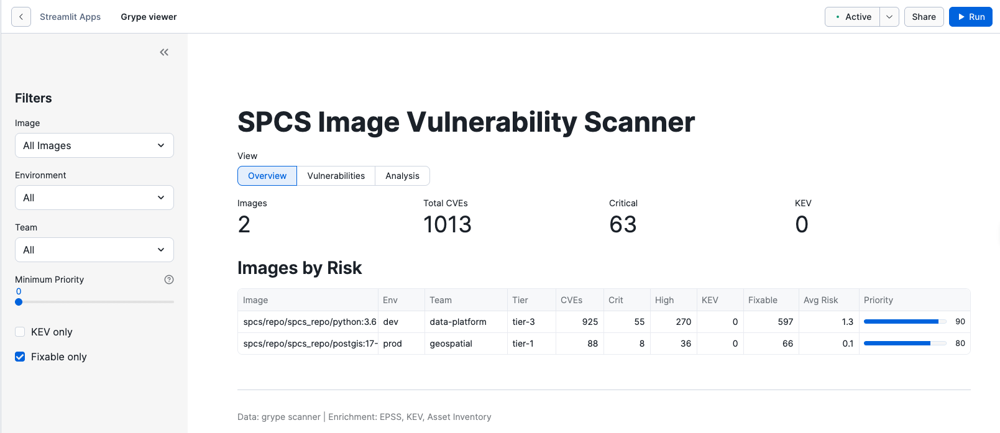

There has been some interest in scanning the container images running in
Snowpark Container Services (SPCS). This article walks through setting up such a
scanner directly in SPCS and a small application that enriches the found data
with external sources.

The article also describes a method to operate on SPCS image repositories
directly within SPCS and using the built-in authentication.

# TL;DR

SPCS is Open Container Initiative (OCI) compatible, so any OCI-compatible tool
that can read from a repository can download images from SPCS and scan them.

Authentication can happen through programmatic access tokens or by using
`snowflake-cli` to generate the `config.json` with `auths` key filled in.


# Process overview

We will:

1. Set up a scanner image with a small wrapper around [`grype`][grype] that uses built-in
   [SPCS token authentication][1]
2. Upload a sample image for scanning. I chose an outdated Python image to
   illustrate the detection capabilities.
3. Run the scanner image as SPCS job, ingest the results into a Snowflake table
4. Auto-ingest the scan results and enrich them with additional details on the image
5. Set up a Streamlit app to view the scan results

A similar pipeline may run in a CI/CD environment outside of Snowflake, but
running it directly in SPCS allows to avoid maintaining credentials in the
CI/CD environment for both image scanning and results upload.

Most important code is inline in the article. Object definitions and Streamlit
code is in the [companion repo][repo].

# Prerequisites

This article relies on the fact that there is a pre-existing SPCS configuration,
e.g. the [common setup][2] for SPCS tutorials.

# Scanner image

The scanner image is a wrapper around `grype` that does two things on top of
running the binary:

1. It constructs the authentication config from the SPCS environment
2. Exports the results into a file named after the `sha256sum` of the scanned
   image

The full code of the wrapper is:

```shell
#!/bin/bash
# grype-wrapper: Authenticates to SPCS registry before running grype
set -euo pipefail

LOCAL_REGISTRY_URL="${ORGNAME,,}-${ACCOUNTNAME,,}.registry-local.snowflakecomputing.com"
TOKEN=$(cat /snowflake/session/token)

# Create Docker config directory and auth file
mkdir -p /root/.docker
cat > /root/.docker/config.json <<EOF
{
  "auths": {
    "${LOCAL_REGISTRY_URL}": {
      "auth": "$(echo -n "0auth2accesstoken:${TOKEN}" | base64 -w 0)"
    }
  }
}
EOF

echo "Authenticated to ${LOCAL_REGISTRY_URL}"
IMAGE_TO_SCAN=$1
OUTPUT_DIR=$2

RESULT=$(grype "$IMAGE_TO_SCAN" --output json)
OUTPUT_FILE_NAME=$(echo "$RESULT" | jq -r '.source.target.imageID')

echo "$RESULT" > "$OUTPUT_DIR"/"$OUTPUT_FILE_NAME"
echo "Scan results of $IMAGE_TO_SCAN written into $OUTPUT_DIR/$OUTPUT_FILE_NAME"
```

Note the use of a slightly different registry URL. This URL should be used when
manipulating the container registry when running inside SPCS. We will come back
to this at the job execution step.

Corresponding `Dockerfile` is simple:

```Dockerfile
FROM --platform=linux/amd64 alpine:3.19
# Production image should use a different approach, not curl | bash and should generally not keep curl around
# This approach is, however, concise
RUN apk add --no-cache curl bash coreutils jq \
    && curl -sSfL https://raw.githubusercontent.com/anchore/grype/main/install.sh | sh -s -- -b /usr/local/bin

# Add wrapper script
COPY grype-wrapper /grype-wrapper
RUN chmod +x /grype-wrapper
ENTRYPOINT ["/grype-wrapper"]
```

Now, to build, tag and push the image:

```shell
# The exact values for this command should be taken from DESC IMAGE REPOSITORY
docker build -t $REGISTRY_URL/$DB/$SCHEMA/$REPO_NAME/grype:latest .
snow spcs image-registry login # use snowflake-cli to log into the registry
docker push $REGISTRY_URL/$DB/$SCHEMA/$REPO_NAME/grype:latest
```

# Sample image upload

For the purposes of this article, I chose `python:3.6` as a reasonably old image
with plenty of known vulnerabilities:

```
docker pull python:3.6
docker tag python:3.6 $REGISTRY_URL/$DB/$SCHEMA/$REPO_NAME/python:3.6
docker push $_
```

# Running the scanner job

To execute the uploaded image, create a stage to hold the results:

```
CREATE STAGE IF NOT EXISTS scan_results_stage
    DIRECTORY = (ENABLE = TRUE)
    COMMENT = 'Stage for grype scan result JSON files';

```

And run the following SQL (replacing the $-variables with the necessary values):

```SQL
SET _ORGNAME=(SELECT LOWER(CURRENT_ORGANIZATION_NAME()));
SET _ACCOUNTNAME=(SELECT LOWER(CURRENT_ACCOUNT_NAME()));

EXECUTE JOB SERVICE IN COMPUTE POOL $COMPUTE_POOL
EXTERNAL_ACCESS_INTEGRATIONS = ($NETWORK_INTEGRATION)  -- Needed for grype DB updates
FROM SPECIFICATION_TEMPLATE
$$
spec:
    container:
    - name: main
      image: /$DB/$SCHEMA/$%REPO_NAME/grype:latest # Does not need to be the same as the target image
      env:
        GRYPE_DB_AUTO_UPDATE: 'true'
        ORGNAME: '{{ _ORGNAME }}'
        ACCOUNTNAME: '{{ _ACCOUNTNAME }}'
        OUTPUT_DIR: '/output'
      volumeMounts:
        - name: results
          mountPath: /output
      args:
        - registry:{{ _ORGNAME }}-{{ _ACCOUNTNAME }}.registry-local.snowflakecomputing.com/$DB/$SCHEMA/$REPO_NAME/python:3.6
        - /output
    volumes:
      - name: results
        source: '@scan_results_stage'
capabilities:
    snowflakeImageRepository:
        readWrite:
          - '/$DB/$SCHEMA/$REPO_NAME'
$$
USING (
    _ORGNAME=>$_ORGNAME,
    _ACCOUNTNAME=>$_ACCOUNTNAME
);
```

Note two things:

1. An extra capability, `capabilities.snowflakeImageRepository.readWrite`.
   Setting it allows the container to gain access to the image repo.
2. I did not specify an explicit `NAME` for the `JOB` object. If the name is
   omitted, SPCS will use an auto-generated name. This is handy in cases you're
   iterating on a `JOB` definition and don't feel like incrementing the name
   over and over

You can retrieve the output of the job run in UI by looking at Monitoring >
Services & Jobs. It should deposit a JSON file with scan results into a stage.

To inspect the JSON, you can run:

```
CREATE OR REPLACE FILE FORMAT json TYPE = 'json'; -- If one is necessary
SELECT
  $1:source.target.imageID::VARCHAR AS imageID,
  REGEXP_REPLACE($1:source.target.userInput::VARCHAR, '^.*/', '') AS target,
  METADATA$FILENAME
FROM @scan_results_stage
  (FILE_FORMAT => json);
```

This will show some fields extracted from the JSON result file.

# Results pipeline

The JOB definition above will deposit the result out into a Snowflake internal
stage. To parse those results as they appear and store them in a Snowflake
table, we can use a SNOWPIPE. Full code and object definitions are in the
[companion repo][repo], but the gist is:

1. JOB produces files to `@scan_results_stage`, 
2. A pipe ingests the files into `scan_results_raw`
3. A dynamic table parses JSON from `scan_results_raw` and flattens the findings

Dynamic table will also remove the `registry-local` prefix from the image tag to
keep the tag a bit shorter.

As a stand-in for enrichment, let's add a table that attributes the built images
to environments and internal teams. `grype` provides certain information
(EPSS, KEV, risk score) out of the box, but we can use data in Snowflake to add
company-specific information to the images.

```
CREATE TABLE IF NOT EXISTS asset_inventory (
    image_pattern       STRING,
    environment         STRING,
    owning_team         STRING,
    criticality         STRING
);

-- Sample data
INSERT INTO asset_inventory VALUES
    ('%python:3.6%', 'dev', 'data-platform', 'tier-3'),
    ('%postgis%', 'prod', 'geospatial', 'tier-1');

CREATE OR REPLACE VIEW scan_results_enriched AS
SELECT
    s.*,
    a.environment,
    a.owning_team,
    a.criticality,
    -- Simple sorting logic.
    -- Priority: KEV > high EPSS > severity
    CASE
        WHEN s.is_kev THEN 100
        WHEN s.risk_score >= 80 THEN s.risk_score
        WHEN s.epss_score >= 0.1 THEN 90
        WHEN s.severity = 'Critical' THEN 80
        WHEN s.severity = 'High' THEN 60
        ELSE 40
    END AS priority_score
FROM scan_results s
LEFT JOIN asset_inventory a ON s.image_tag LIKE a.image_pattern;

```

Sample output from it:

```
snow sql --query "SELECT * FROM scan_results_enriched WHERE IMAGE_TAG ilike '%python:3.6%' LIMIT 1" --format json
[
    {
        "IMAGE_TAG": "db/schema/repo/python:3.6",
        "IMAGE_ID": "sha256:8c1c1d9c1f7000f6d70c3c6f6e6e4af4b5be7093cf36664bc7782b47536b9ed9",
        "MANIFEST_DIGEST": "sha256:6b38ac662248fefa063a111bf2ad90812583c7295a6b912e563c969795a0e4d8",
        "DISTRO_NAME": "debian",
        "DISTRO_VERSION": "11",
        "CVE_ID": "CVE-2022-37434",
        "SEVERITY": "Critical",
        "DESCRIPTION": "zlib through 1.2.12 has a heap-based buffer over-read or buffer overflow in inflate in inflate.c via a large gzip header extra field. NOTE: only applications that call inflateGetHeader are affected. Some common applications bundle the affected zlib source code but may be unable to call inflateGetHeader (e.g., see the nodejs/node reference).",
        "RISK_SCORE": 86.99136,
        "EPSS_SCORE": 0.92544,
        "EPSS_PERCENTILE": 0.9973,
        "IS_KEV": false,
        "CVSS_SCORE": 9.8,
        "CVSS_VECTOR": "CVSS:3.1/AV:N/AC:L/PR:N/UI:N/S:U/C:H/I:H/A:H",
        "FIX_STATE": "fixed",
        "FIXED_VERSION": "1:1.2.11.dfsg-2+deb11u2",
        "PACKAGE_NAME": "zlib1g",
        "PACKAGE_VERSION": "1:1.2.11.dfsg-2",
        "PACKAGE_TYPE": "deb",
        "PACKAGE_PURL": "pkg:deb/debian/zlib1g@1%3A1.2.11.dfsg-2?arch=arm64&distro=debian-11&upstream=zlib",
        "FILENAME": "sha256:8c1c1d9c1f7000f6d70c3c6f6e6e4af4b5be7093cf36664bc7782b47536b9ed9",
        "INGESTED_AT": "2026-02-20T16:27:14.092000",
        "ENVIRONMENT": "dev",
        "OWNING_TEAM": "data-platform",
        "CRITICALITY": "tier-3",
        "PRIORITY_SCORE": 86.99136
    }
]
```

# Viewing results in Streamlit

[The repo][repo] has a sample Streamlit app that shows the scan results as a
report that allows browsing results by image/envrionment/team. Screenshot:



# Conclusion

We now have a scanner pipeline that will fetch the latest vulnerability
database, scan an image directly in SPCS and produce results for monitoring by
the admins. 

# Potential improvements

1. Use volume snapshots to reuse `grype` database. To use a pattern like this,
   you can create a separate JOB that will pull in the latest database into a
   block volume and call [`CREATE SNAPSHOT`][CS] to produce a reusable volume that is
   mounted into the scanning job.
2. The container image with `grype` scanner is fine for illustration purposes, but
   a production image should use something other than `curl` to install software.
   Moreover, `curl` is not necessary for the final image at all.
3. Wrap the JOB in a stored proc that will run as an owner so a lower-privileged
   role can trigger it. Do note that If running the JOB with a restricted
   identity, you must grant SERVICE READ to that role, see [this doc][3]
4. Since the results of the scan are a function of mulitple variables, change
   the file name schema to reflect the version of the database and `grype`. Or use
   a preferred format of [slowly changing dimensions][SCD] to keep track of the
   scan results.
5. You can integrate this with Snowflake Trust Center using the [Trust Center
   Extensions][TCE] framework and tap into the standard security pipeline for
   the Snowflake account


[1]: https://docs.snowflake.com/en/developer-guide/snowpark-container-services/spcs-execute-sql#using-snowflake-provided-service-user-credentials
[2]: https://docs.snowflake.com/en/developer-guide/snowpark-container-services/tutorials/common-setup
[3]: https://docs.snowflake.com/en/developer-guide/snowpark-container-services/working-with-registry-repository#repository-privileges
[SCD]: https://en.wikipedia.org/wiki/Slowly_changing_dimension
[TCE]: https://docs.snowflake.com/en/user-guide/trust-center/trust-center-extensions#develop-a-trust-center-extension
[repo]: https://github.com/sfc-gh-vtimofeenko/spcs-image-scanning
[grype]: https://github.com/anchore/grype
[CS]: https://docs.snowflake.com/en/sql-reference/sql/create-snapshot
